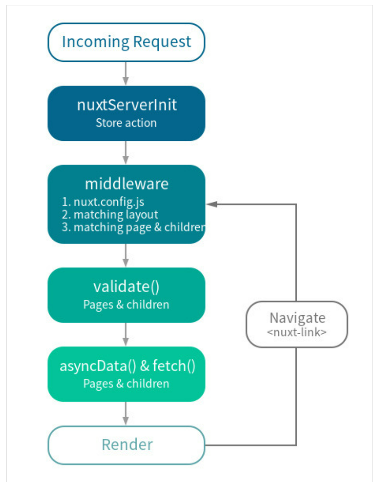
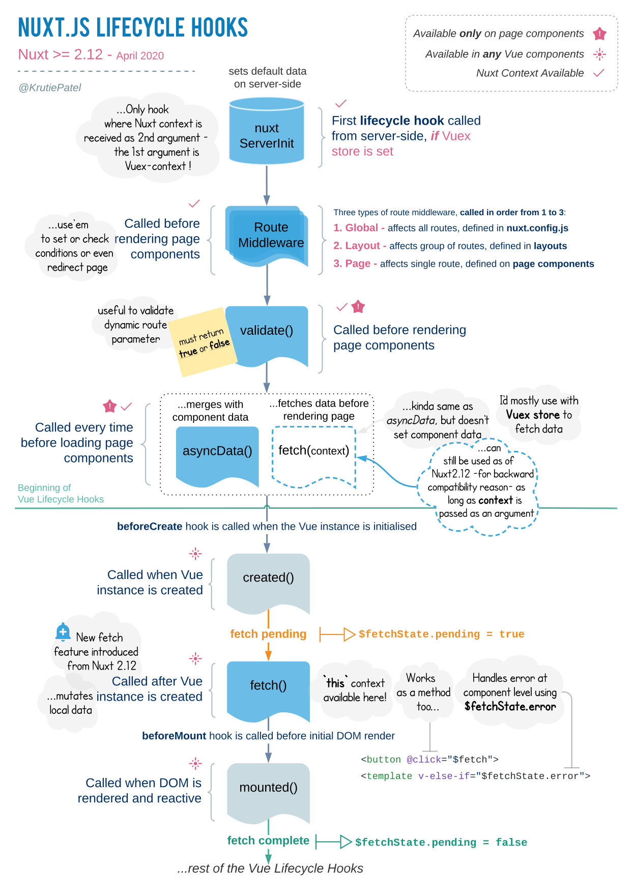
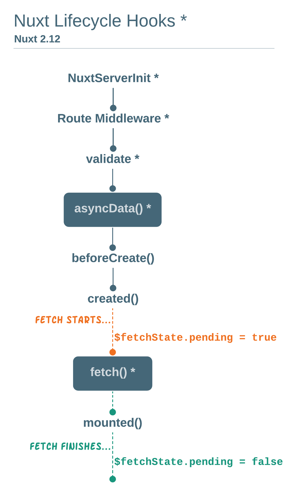

# Nuxt.js

## CSR(Client Side Rendering)

SPA(Single Page Application)에서 사용되는 방식
최초 한 번 페이지를 전체 로딩 후 데이터만 변경해서 사용하는 웹 애플리케이션

### 장점

- 자연스러운 UX
- 필요한 리소스만 부분적으로 로딩
- 서버의 템플릿 연산을 클라이언트로 분산
- 컴포넌트 별 개발 용이
- 모바일 앱에서도 동일한 API 사용가능

### 단점

- javascript 파일을 번들링해서 한 번에 받기 때문에 초기 구동 속도가 느림
- 검색 엔진 최적화(SEO, 웹 사이트 검색 결과가 더 잘보이도록 하는 과정)가 어렵다

## SSR

서버에서 사용자에게 보여줄 페이지를 모두 렌더링하여 띄우는 방식

### 장점

- 검색엔진 최적화(SEO)

### 단점

- 페이지 이동 시 화면 깜빡임
- 페이지 이동 시 불필요한 템플릿도 중복해서 로딩
- 서버 렌더링에 따른 부하
- 모바일 앱 개빌 시 추가적인 백엔드 작업 필요

- 페이지 이동 시 깜빡임을 보완하기 위하여 새로운 SSR 개념이 등장하였고, `Universal App`이라고 한다.

## Nuxt.js

Vue.js 프레임워크 기반의 개발 환경 구축에 도움을 주는 프레임워크.

> Nuxt.js에서의 서버 개념은 Api 를 정의하는 서버가 아닌, Nuxt.js에 내장된 Express(Node.js) 서버를 지칭한다.
> Nuxt.js는 SSR 구현을 위해 Express 서버를 내장하고 있다.

### 특징

- Vue 파일 사용
- 코드 분할 자동화
- SSR
- 비동기 데이터 기반의 강력한 라우팅 시스템
- 정적 파일 전송
- JS & CSS 코드 번들링 및 압축
- 개발 중 Hot Module 대체
- 전 처리기 지원: SASS, LESS, Stylus 등

### 디렉터리 구조

- assets
  - Resource 들이 위치한다.
- components
  - 애플리케이션에서 사용할 컴포넌트들이 위치한다.
  - 해당 경로에 위치한 컴포넌트들은 `asyncData`, `fetch`를 사용할 수 없다.(컴포넌트 생성 전에 실행되기 때문.)
- layouts
  - 애플리케이션 전체 레이아웃이 위치
  - 디렉터리 이름 변경 불가
- middleware
  - 애플리케이션에서 사용될 middleware가 위치한다.
  - 페이지 또는 레이아웃이 렌더링되기 전에 실행된다.
  - 페이지나 레이아웃에 바인딩한 경우, 해당 페이지나 레이아웃이 실행되기 전에 매번 실행한다.
- pages
  - 실제 애플리케이션 페이지 구성이 위치한다.
  - 디렉터리의 구조에 따라 router가 자동 생성된다.
  - 디렉터리 이름 변경 불가
- plugins
  - 애플리케이션에 포함될 내,외부 plugins를 포함
  - 애플리케이션이 인스턴스화 되기 전에 실행, 전역 구성 요소를 등록하고 함수 또는 상수를 삽입할 수 있다.
- static
  - 정적 파일이 위치한다.
  - 구성에 따라 html, js파일도 포함가능
  - 디렉터리 이름 변경 불가
- store
  - 애플리케이션에 사용될 store 파일이 위치
  - 비활성 상태가 기본 값
  - store 디렉터리에 `index.js` 파일을 작성하면 store가 활성화 된다.
  - 구성에 따라 모듈 형태의 store를 형성할 수 있음.
- content
  - 옵션
  - `@nuxt/content` 모듈을 사용하여 애플리케이션을 확장
  - Markdown, JSON, YAML, XML, CSV와 같은 파일을 가져오고 관리할 수 있음.

## 렌더링 모드

Nuxt.js는 3가지 모드를 지원한다.

- Single Page App(SPA)
- Universal App
- Static App

`nuxt.config.js`에서 `mode` 프로퍼티를 통해 설정

### Universal App

- 새로운 방식의 SSR
- SSR + CSN(Client Side Navigation)



https://www.a-ha.io/questions/4b35011ae851461fbd04f6467782da0c

#### Nuxt.js의 SSR 동작 과정

서버 사이드에서 Request가 도착하면

1. nuxtServeInit
2. middleware
3. validate()
4. asyncData()
5. fetch()

5가지 과정을 거친 후 렌더링한 페이지를 response한다.
이 후, nuxt-link 태그로 Navagate가 이루어 진다(CSN).

#### CSN

프리페치 + 하이드레이션 과정으로 이루어짐.

Nuxt.js는 Universal 모드에서 기본적으로 요청한 URL을 통해 서버에서 렌더링할고 클라이언트에게 넘겨준다.
이런 일련의 SSR 방식으로 화면의 깜빡임이 발생할 수밖에 없는데, Nuxt.js는 **프리 페치(Pre-fetch)**로 깜빡임이 발생하지 않는다.

> 프리 페치
> CSN에 해당하는 과정
> Universal App에서만 사용되는 방식이 아니라, Vue CLI와 같은 SPA에서도 제공하는 기능

#### 프리 페치

프리 페치는 **미리 데이터를 가지고 온다**라는 뜻.
Nuxt.js는 `nuxt-link`를 통해 렌더링 해야할 다음 페이지를 미리 가지고 온다.
(Vue router의 `router-link`와 같음)

Nuxt.js는 처음 서버에서 데이터와 함께 HTML을 렌더링하고, 그 이후 viewport(화면에 보여지는 페이지)의 `nuxt-link`로부터
다음 페이지를 예측해 백 그라운드에서 청크 파일을 다운로드 해온다.

> 청크파일
> 파일의 형식은 js
> Nuxt.js는 자동 Code splitting을 지원(파일 용량을 줄이기 위해 코드를 자르는 것.)

Nuxt.js는 새 페이지를 렌더링할 때, 서버에 매번 렌더링 한 HTML을 요청하지 않고 브라우저가 렌더링 할 수 있도록 돕는 js 파일을 요청한다.

**Universal App이 깜빡임 없이 페이지를 로드해 올 수 있는 이유는 다음 페이지에 대한 데이터(.js)를 미리 받아오기 때문이다.**

#### 하이드레이션

렌더링 과정을 마치고 브라우저로 전달된 HTML 파일 위에 남은 자바스크립트 코드를 실행하는 동작.
하이드레이션으로 인해 SSR 앱임에도 기존 SPA와 동일한 동작과 반응성을 보장할 수 있다.

> ! 페이지 이동 후 이루어지는 동작들을 하이드레이션이라 한다.

## 라우팅

- Basic Route
- Dynamic Route

### Basic Route

Nuxt.js는 `/pages` 폴더에 파일만 생성해주면 자동으로 라우팅된다.

`http://localhost:3000/home/detail`으로 접속했을 때,
`pages/home/detail.vue` 가 라우팅된다.

페이지를 생성한 즉시 `.nuxt/router.js`에서 자동 설정이 이뤄지기 때문이다.

### Basic Route - 중첩 라우팅

`/pages/Container.vue`

```html
<template>
  <div>
    <div class="container">
      Container 컴포넌트 입니다.
      <nuxt-child />
    </div>
  </div>
</template>

<script>
  export default {};
</script>

<style scoped>
  .container {
    width: 300px;
    height: 300px;
    background-color: pink;
    z-index: 0;
  }
</style>
```

상위 컴포넌트 내에 하위 컴포넌트가 들어갈 자리인 `<nuxt-child></nuxt-child>`를 정의해주면
하위 컴포넌트 조회 시 상위 컴포넌트가 조회한 하위 컴포넌트를 포함하여 보인다.

### Dynamic Route

언더바 + 파일이름 형태로 파일을 생성하면 해당 파일 이름의 파라미터를 받는다.

1. `pages/products/edit/_product_id.vue` 생성
2. `http://localhost:3000/products/edit/1` 로 접속 시 생성한 Vue 파일 호출

`$route.params.product_id`로 파라미터 값 사용 가능

### validate()

화면 전환 시 파라미터의 유효성 검사를 할 수 있다.

```javascript
validate({ params, query, store }) {
  return true // if the params are valid
  return false // will stop Nuxt.js to render the route and display the error page
}
```

Nuxt.js에서 제공하는 `valicate()` 메서드를 이용하면 된다.

- `validate()`는 새 라우터로 네비게이팅(navigating) 되기 전에 call 된다.
- Nuxt Context 객체를 Argument 로 갖는다.
- 유효성 검사에 통과하지 못할 시 404 에러를 보낸다.

## Middle Ware

`pages` 또는 `layouts`를 렌더링하기 전에 실행할 수 있는 기능
미들웨어가 해결되기 전까지 아무것도 표시하지 않는다.
`validate()` 대신 사용할 수도 있다.

## Plugins

`plugins` 디렉터리를 사용하면 애플리케이션이 생성되기 전 Vue 플러그인을 등록할 수 있다.
이렇게 등록된 플러그인은 Vue 인스턴스 앱 전체에서 공유하고 모든 구성 요소에서 엑세스할 수 있다.

## 비동기 데이터 가져오기

Nuxt.js는 두가지 훅을 지원한다.

- asyncData
- fetch

### asyncData

- 컴포넌트 데이터를 세팅하기 전에 비동기 처리를 할 수 있도록 한다.
- 컴포넌트를 로드하기 전에 호출된다.
- pages 컴포넌트에서만 사용 가능하다.
- Context 객체를 첫번째 인수로 받으며, 이를 사용해 일부 데이터를 가져와 컴포넌트 데이터로 반환할 수 있다.
- 반환 값은 컴포넌트의 data와 병합된다.
- 컴포넌트를 초기화하기 전에 실행되기 때문에 메서드 내부에서 this를 통해 컴포넌트 인스턴스에 접근할 수 없다.

```javascript
export default {
  async asyncData({ params }) {
    const { data } = await axios.get(`https://my-api/posts/${params.id}`);
    return { title: data.title };
  }
};
```

### fetch

- 페이지가 렌더링 되기 전에 데이터를 Store에 넣기 위해 사용된다.
- 모든 컴포넌트에서 사용 가능하다.
- 컴포넌트를 로드하기 전에 호출된다.
- Context 객체를 첫번째 인수로 받으며 그 데이터를 스토어에 넣을 수 있다.
- **return 값은 Promise이다.**
- Promise를 반환하면 Nuxt는 렌더링 전에 **Promise가 끝날때**까지 기다린다.

## Nuxt.js Context

Nuxt.js는 모든 메서드에 Context라는 객체를 포함하는 인수를 제공한다.
Context에는 앱 전체에서 참조해야하는 모든 것이 있다.
즉, Vue가 컴포넌트에 대한 참조를 먼저 생성할 때까지 기다릴 필요가 없다.

## Nuxt.js Life Cycle


https://ko.nuxtjs.org/docs/2.x/concepts/nuxt-lifecycle/#server

### Nuxt.js Life Cycle Hooks



Nuxt.js 2.12 전에는 `fetch()`를 `asyncData()`와 같이 컴포넌트가 생성되기 전에 실행 해줬어야 했지만,
2.12 이후엔 `created()` 이후, 쉽게 말하면 Vue 컴포넌트가 생성되고 난 후에 사용할 수 있게 되었다.
정확한 시기는 브라우저에 DOM이 렌더되기 전에 실행된다(beforeMount 전)

사용시기가 바뀐 후 `fetch()`에서 `this` 사용이 가능하다.
